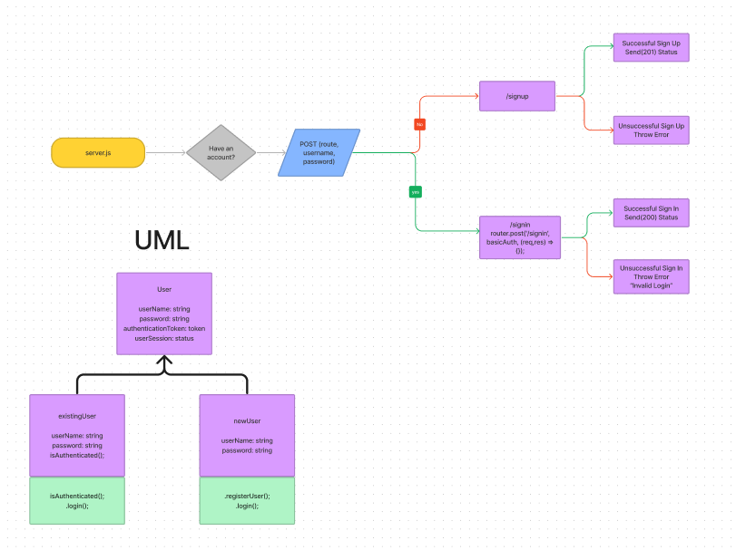

# LAB: Class 06

## Authentication

- Authentication System Phase 1: Deploy an Express server that implements Basic Authentication, with sign-up and sign-in capabilities, using a Postgres database for storage.

## Setup

- `.env` requirements:
  - `PORT` = 3000
  - `DATABASE_URL` = add your heroku postgres link
- run `npm i` or `npm install` in the terminal to add the required dependencies
- make sure you have

## How to start your server

- run `npm start` or `npm run dev` to use nodemon

## Tests

- POST to `/signup` to create a new user
- POST to `/signin` to login as a user (use basic auth)
- Need tests for auth middleware and the routes
  - does the middleware function (send it a basic header)
  - do the routes assert the requirements (signup/signin)
- This is going to require more "end-to-end" testing that you've done in the past
  - To test signin, your tests need to create a user first, then try and login, so there's a dependency built-in

# LAB: Class 07

## Authorization

## Tests

- POST to `/signup` to create a new user
- POST to `/signin` to login as a user (use basic auth)
- Need tests for auth middleware and the routes
  - does the middleware function (send it a basic header)
  - do the routes assert the requirements (signup/signin)
- This is going to require more "end-to-end" testing that you've done in the past
  - To test signin, your tests need to create a user first, then try and login, so there's a dependency built-in

## UML

